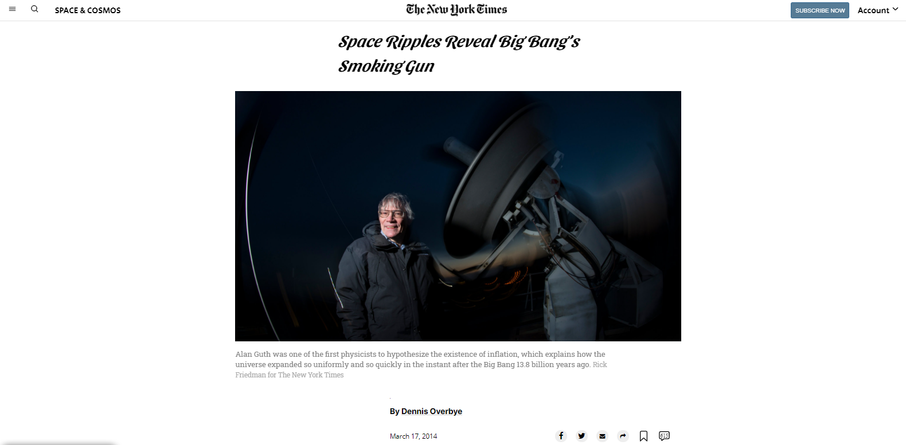

# News Information Page - The New York Times Clone

> We created a clone of a view of The New York Times portal from scratch.

The New York Times Clone
This web page was project number 3 of the microverse curriculum.
We intend to make the page as similar to the original as possible.

## Built With

- HTML5
- CSS3
- Git
- Github
- Lintern
- VSCode

## Live Demo

[Live Demo Link](https://aristides1000.github.io/the-new-york-times-copy/)

## Getting Started

This project was created for the sole purpose of learning how to use HTML Inputs, positioning, and flexbox and grid. The following will be instructions on how you can view the project on your own computer.

### Prerequisites

Computer running Mac OS, Windows, or Linux Ubuntu. Internet browser: Firefox, Google Chrome, Opera...

### Install

Download the code or copy the git repository to your computer.

### Usage
Run the index.html file.

### Run tests
Linters errors

## Authors

👤 **Author1**
Aristides Jose Molina Pérez

- GitHub: [@aristides1000](https://github.com/aristides1000)
- Twitter: [@aristides_1000](https://twitter.com/@aristides_1000)
- LinkedIn: [aristides jose molina perez](https://www.linkedin.com/in/aristides-jose-molina-perez-09b0579a)

👤 **Author2**
Alejandro Guadalupe Contreras Rodríguez

- GitHub: [@alejandroNo4](https://github.com/AlejandroNo4)
- Twitter: [@Alejand80002666](https://twitter.com/Alejand80002666)
- LinkedIn: [Alejandro Contreras Rodriguez](https://www.linkedin.com/in/alejandro-contreras-rodriguez-b524821b5)

## 🤝 Contributing

Contributions, issues, and feature requests are welcome!

Feel free to check the [issues page](https://github.com/the-new-york-times-copy/issues).

## Show your support

Give a ⭐️ if you like this project!

## Acknowledgments

Ariel Camus CEO Microverse: For letting us start this journey
Google: For letting us find crucial information in order to create this project
